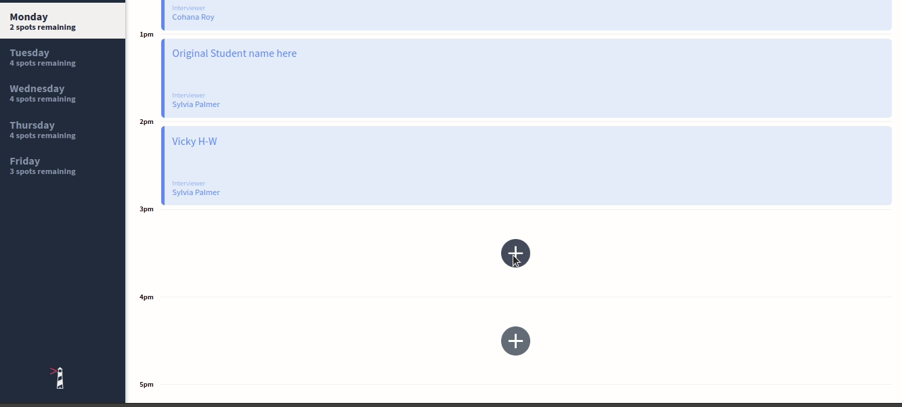
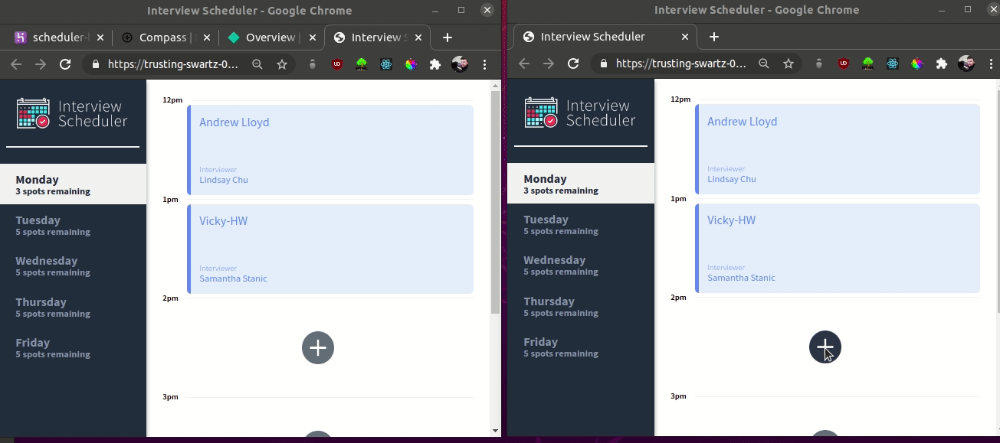
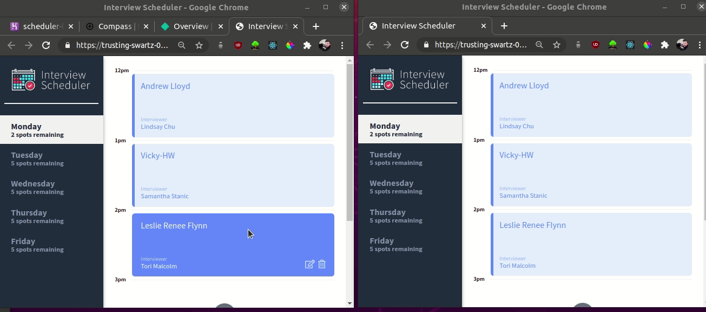
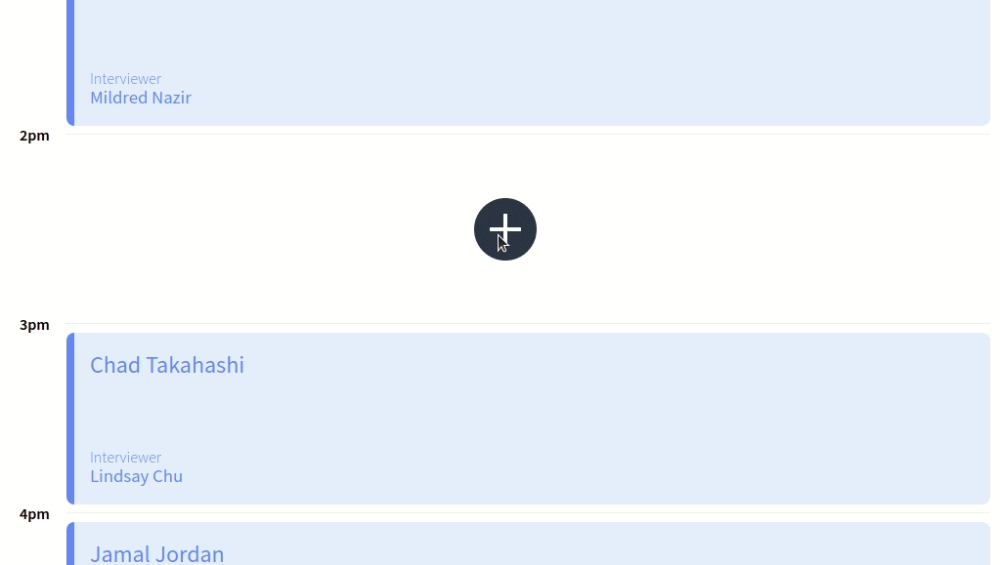
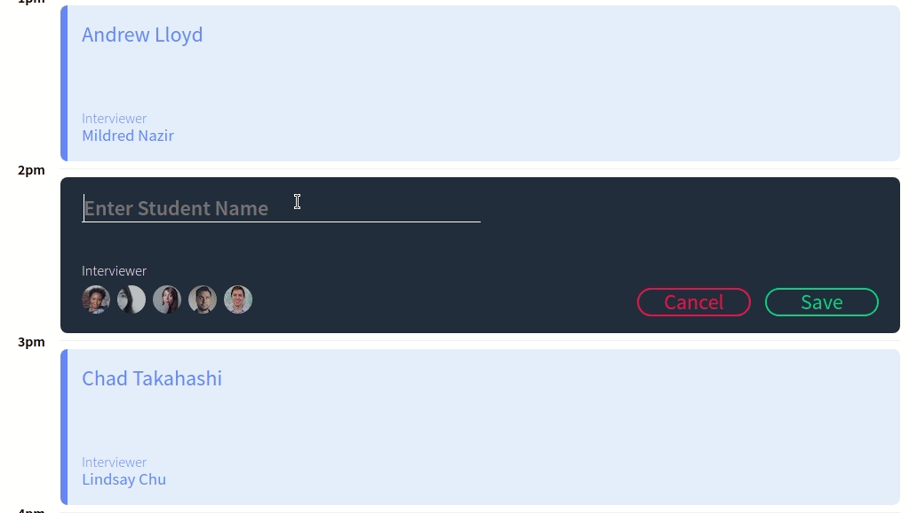
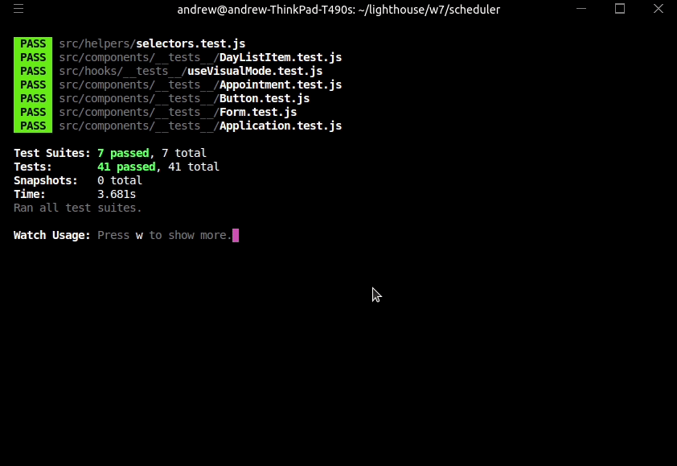
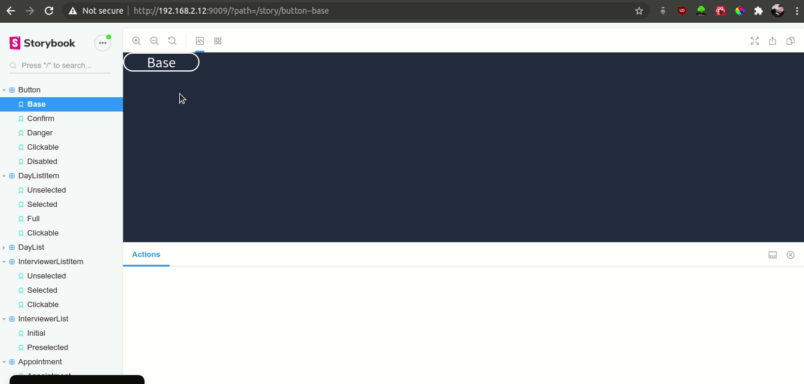

# Interview Scheduler

## Netlify Deploy Link

[https://andrew-lloyd-scheduler.netlify.app/](https://trusting-swartz-0eb30c.netlify.app/)

## Scheduler in Action

Create and edit appointments


Live updating between clients using WebSockets


Edit and Delete appointments


Field validation checking


Error checking and messages to user


# Automated Testing using Cypress


# Testing using Jest



# Storybook Components



## Scheduler Features

Development focuses on a single page application (SPA) called Interview Scheduler, built using React.

Data is persisted by the API server using a PostgreSQL database.

The client application communicates with an API server over HTTP, using the JSON format.

Jest tests are used through the development of the project.

# Setup

Install dependencies with `yarn install`.

## Running Webpack Development Server

```sh
yarn start
```

## Running Jest Test Framework

```sh
yarn test
```

## Running Storybook Visual Testbed

```sh
yarn run storybook
```

# Dependencies

- @testing-library/react-hooks: ^3.4.2 ,
- axios: ^0.20.0 ,
- babel-jest: 24.7.1 ,
- classnames: ^2.2.6 ,
- dotenv: ^8.2.0 ,
- node-sass: ^4.14.1 ,
- normalize.css: ^8.0.1 ,
- react: ^16.9.0 ,
- react-dom: ^16.9.0 ,
- react-scripts : 3.0.0 ,
- ws: ^7.3.1 ,
- yarn: ^1.22.10

# Dev Dependencies

- @babel/core : ^7.4.3 ,
- @storybook/addon-actions : ^5.0.10 ,
- @storybook/addon-backgrounds : ^5.0.10 ,
- @storybook/addon-links : ^5.0.10 ,
- @storybook/addons : ^5.0.10 ,
- @storybook/react : ^5.0.10 ,
- @testing-library/jest-dom : ^4.0.0 ,
- @testing-library/react : ^8.0.7 ,
- @types/react-test-renderer : 16.9.0 ,
- cypress : ^5.3.0 ,
- prop-types : ^15.7.2 ,
- react-test-renderer : ^16.13.1

## Contact

Questions? Comments? Please get in touch via email <andrew.lloyd01@googlemail.com>

README: Last updated October 7, 2020
